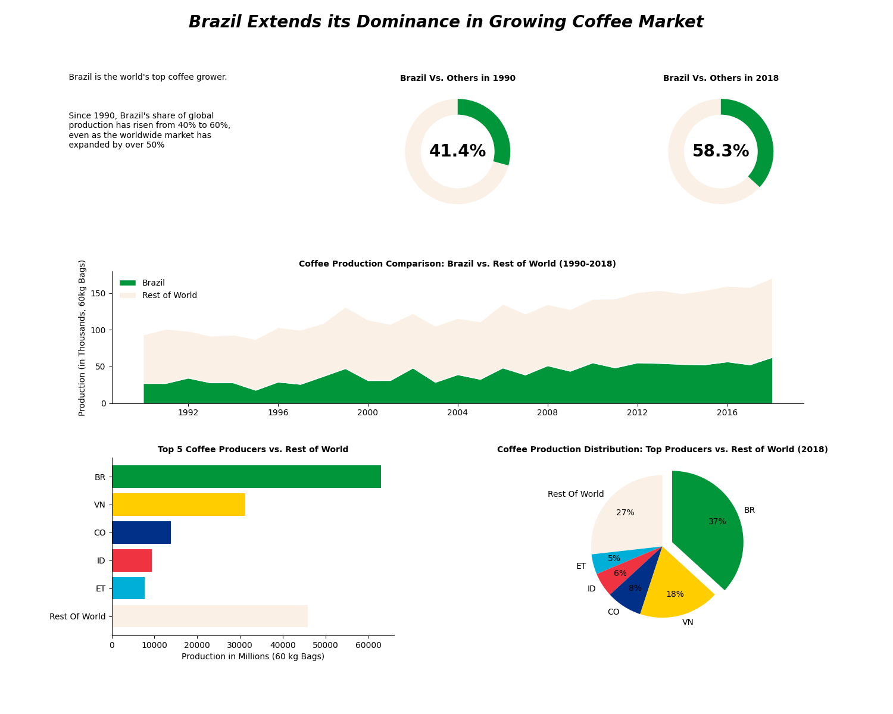

Coffee Production Analysis
==========================

This project dives into an analysis of coffee production data, aiming to uncover
trends in total coffee production across various regions and time periods. I
used Python for data manipulation, exploration, and visualization to help shed
light on production patterns.

Files in this Repository
------------------------

-   `total-production.csv`: The main dataset, with details on coffee production
    by region, month, year, yield, and total production.

-   `Coffee_Analysis.ipynb`: A Jupyter Notebook with all the code used to
    analyze `total-production.csv`. This includes data cleaning, manipulation,
    and visualizations to bring the data to life.

Project Overview
----------------

In this analysis, I focused on:

1.  **Data Cleaning**: Preprocessing steps like handling missing values,
    adjusting data types, and removing unnecessary rows or columns.

2.  **Exploratory Data Analysis (EDA)**: Basic statistics and visualizations
    that reveal underlying patterns in coffee production.

3.  **Data Manipulation**: Transforming data to look at production totals by
    year, region, and month.

4.  **Visualization**: Creating charts and graphs to illustrate trends over time
    and across regions.

Requirements
------------

To run the notebook and reproduce my analysis, you’ll need the following Python
libraries:

-   **Pandas**: For data handling.

-   **Matplotlib**: For plotting.

-   **Seaborn**: (Optional) For more polished visualizations.

If you don’t have them installed, you can install them with:

~~~~~~~~~~~~~~~~~~~~~~~~~~~~~~~~~~~~~~~~~~~~~~~~~~~~~~~~~~~~~~~~~~~~~~~~~~~~~~~~
bashCopy codepip install pandas matplotlib seaborn
~~~~~~~~~~~~~~~~~~~~~~~~~~~~~~~~~~~~~~~~~~~~~~~~~~~~~~~~~~~~~~~~~~~~~~~~~~~~~~~~

How to Use
----------

1.  **Clone the Repository**: Clone this repository to your local machine:

    ~~~~~~~~~~~~~~~~~~~~~~~~~~~~~~~~~~~~~~~~~~~~~~~~~~~~~~~~~~~~~~~~~~~~~~~~~~~~
    bashCopy codegit clone https://github.com/dankends/coffee-production-analysis.git
    ~~~~~~~~~~~~~~~~~~~~~~~~~~~~~~~~~~~~~~~~~~~~~~~~~~~~~~~~~~~~~~~~~~~~~~~~~~~~

2.  **Open the Notebook**: Navigate to the project folder and open the Jupyter
    Notebook:

    ~~~~~~~~~~~~~~~~~~~~~~~~~~~~~~~~~~~~~~~~~~~~~~~~~~~~~~~~~~~~~~~~~~~~~~~~~~~~
    bashCopy codejupyter notebook Coffee_Analysis.ipynb
    ~~~~~~~~~~~~~~~~~~~~~~~~~~~~~~~~~~~~~~~~~~~~~~~~~~~~~~~~~~~~~~~~~~~~~~~~~~~~

3.  **Run the Notebook**: Go through each cell to see the analysis steps and
    visualizations.

Example Code Snippets
---------------------

Some of the code used in the analysis:

-   Loading and displaying the dataset:

    ~~~~~~~~~~~~~~~~~~~~~~~~~~~~~~~~~~~~~~~~~~~~~~~~~~~~~~~~~~~~~~~~~~~~~~~~~~~~
    pythonCopy codeimport pandas as pd
    coffee_production = pd.read_csv("total-production.csv")
    coffee_production.head()
    ~~~~~~~~~~~~~~~~~~~~~~~~~~~~~~~~~~~~~~~~~~~~~~~~~~~~~~~~~~~~~~~~~~~~~~~~~~~~

-   Setting the first row as column headers:

    ~~~~~~~~~~~~~~~~~~~~~~~~~~~~~~~~~~~~~~~~~~~~~~~~~~~~~~~~~~~~~~~~~~~~~~~~~~~~
    pythonCopy codecoffee_production.columns = coffee_production.iloc[0]
    coffee_production = coffee_production.drop(0).reset_index(drop=True)
    ~~~~~~~~~~~~~~~~~~~~~~~~~~~~~~~~~~~~~~~~~~~~~~~~~~~~~~~~~~~~~~~~~~~~~~~~~~~~

-   Dropping unnecessary columns:

    ~~~~~~~~~~~~~~~~~~~~~~~~~~~~~~~~~~~~~~~~~~~~~~~~~~~~~~~~~~~~~~~~~~~~~~~~~~~~
    pythonCopy codecoffee_production.drop('total_production', axis=1, inplace=True)
    ~~~~~~~~~~~~~~~~~~~~~~~~~~~~~~~~~~~~~~~~~~~~~~~~~~~~~~~~~~~~~~~~~~~~~~~~~~~~

Results
-------

The analysis reveals Brazil’s growing dominance in the global coffee market:

-   **Brazil's Share of Global Production**: Brazil's share of global coffee
    production rose from 41.4% in 1990 to 58.3% in 2018, showing a significant
    increase over the years.

-   **Comparison with Other Producers**: The top five coffee-producing countries
    (Brazil, Vietnam, Colombia, Indonesia, and Ethiopia) account for a major
    share of global production, with Brazil alone making up 37% in 2018.

-   **Historical Production Trends**: A trend analysis from 1990 to 2018 shows
    Brazil steadily expanding its market share, even as global coffee production
    continues to grow. This is illustrated in the line and area charts in the
    report.

The visuals in `My_Report.png` summarize these findings, demonstrating Brazil’s
leading role in coffee production and providing a breakdown of the global
production distribution as of 2018.

License
-------

This project is open-source under the MIT License.
